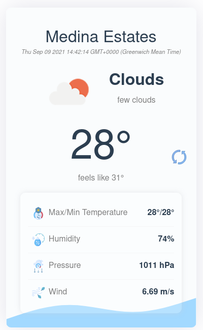

# La Météo

[](https://app.netlify.com/sites/lameteo/deploys)

La Météo simple weather app built with Vue.js to display the latest weather information of the user's current location. It uses the OpenWeatherMap API.
<br>
<br>


## Concepts applied

- Single File Components
- Fetching data from API (OpenWeatherMap API) with Axios
- Passing data between child and parent components
- Vue Router
- Using .env file to secure API key
- PWA specifications
- Deployment


## Project setup
```
npm install
```

### Compiles and hot-reloads for development
```
npm run serve
```

### Compiles and minifies for production
```
npm run build
```

### Lints and fixes files
```
npm run lint
```

### Customize configuration
See [Configuration Reference](https://cli.vuejs.org/config/).
